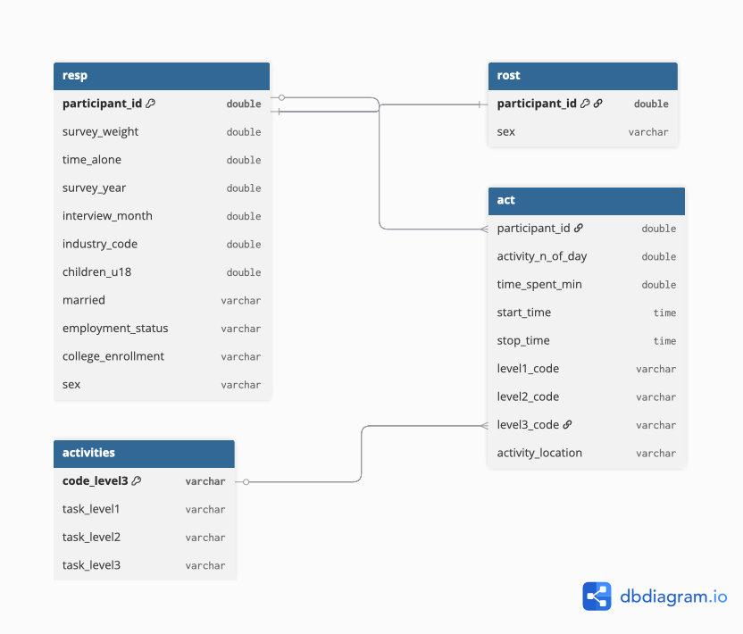

# Mini-Project #02: How Do You Do "You Do You"?

## Introduction

The American Time Use Survey (ATUS) provides detailed information on how
individuals allocate their time across daily activities. This report analyzes
ATUS microdata from 2003 to 2024, exploring how Americans spend their time
across activities and demographic groups.

## Data Acquisition
```{r}
#| label: setup

library(tidyverse)
library(glue)
library(httr2)

load_atus_data <- function(file_base = c("resp", "rost", "act")){
    if(!dir.exists(file.path("data", "mp02"))){
        dir.create(file.path("data", "mp02"),
                   showWarnings = FALSE, recursive = TRUE)
    }
    file_base     <- match.arg(file_base)
    file_name_out <- file.path("data", "mp02",
                               glue("atus{file_base}_0324.dat"))
    if(!file.exists(file_name_out)){
        url_end  <- glue("atus{file_base}-0324.zip")
        temp_zip <- tempfile(fileext = ".zip")
        temp_dir <- tools::file_path_sans_ext(temp_zip)
        request("https://www.bls.gov") |>
            req_url_path("tus", "datafiles", url_end) |>
            req_headers(`User-Agent` = "Mozilla/5.0 (Macintosh; Intel Mac OS X 10.15; rv:143.0) Gecko/20100101 Firefox/143.0") |>
            req_perform(temp_zip)
        unzip(temp_zip, exdir = temp_dir)
        file.copy(file.path(temp_dir, basename(file_name_out)),
                  file_name_out)
    }
    file <- read_csv(file_name_out, show_col_types = FALSE)
    switch(
        file_base,
        resp = file |>
            rename(
                survey_weight   = TUFNWGTP,
                time_alone      = TRTALONE,
                survey_year     = TUYEAR,
                interview_month = TUMONTH,
                industry_code   = TEIO1ICD
            ) |>
            mutate(
                children_u18 = TRCHILDNUM,
                married = case_match(
                    TRSPPRES,
                    1 ~ "Married",
                    2 ~ "Not married",
                    .default = "Not married"
                ),
                college_enrollment = case_when(
                    TESCHENR == 1 & TESCHLVL == 2 ~ "College/University",
                    TESCHENR == 1 & TESCHLVL == 1 ~ "Not college",
                    TESCHENR == 2                  ~ "Not enrolled",
                    TRUE                           ~ NA_character_
                ),
                employment_status = case_when(
                    TELFS %in% c(1,2) & TRDPFTPT == 1 ~ "Employed full-time",
                    TELFS %in% c(1,2) & TRDPFTPT == 2 ~ "Employed part-time",
                    TELFS %in% c(1,2)                 ~ "Employed",
                    TELFS %in% c(3,4)                 ~ "Unemployed",
                    TELFS == 5                        ~ "Not in labor force",
                    TRUE                              ~ NA_character_
                )
            ),
        rost = file |>
            mutate(
                sex = case_match(TESEX,
                                 1 ~ "M", 2 ~ "F",
                                 .default = NA_character_)
            ),
        act = file |>
            mutate(
                activity_n_of_day = TUACTIVITY_N,
                time_spent_min    = TUACTDUR24,
                start_time        = TUSTARTTIM,
                stop_time         = TUSTOPTIME,
                level1_code       = paste0(TRTIER1P, "0000"),
                level2_code       = paste0(TRTIER2P, "00"),
                level3_code       = as.character(TRCODEP),
                activity_location = case_match(
                    TEWHERE,
                    1  ~ "Respondent's home or yard",
                    2  ~ "Workplace",
                    3  ~ "Someone else's home",
                    4  ~ "Restaurant or bar",
                    5  ~ "Place of worship",
                    6  ~ "Grocery store",
                    7  ~ "Other store or mall",
                    8  ~ "School",
                    9  ~ "Outdoors away from home",
                    10 ~ "Library",
                    11 ~ "Other place",
                    12 ~ "Car, truck, or motorcycle (driver)",
                    13 ~ "Car, truck, or motorcycle (passenger)",
                    14 ~ "Walking",
                    15 ~ "Bus",
                    16 ~ "Subway or train",
                    17 ~ "Bicycle",
                    18 ~ "Boat or ferry",
                    19 ~ "Taxi or limousine",
                    20 ~ "Airplane",
                    21 ~ "Other mode of transportation",
                    30 ~ "Bank",
                    31 ~ "Gym or health club",
                    32 ~ "Post office",
                    89 ~ "Unspecified place",
                    99 ~ "Unspecified transportation",
                    .default = "Other/Unknown"
                )
            )
    ) |>
        rename(participant_id = TUCASEID) |>
        select(matches("[:lower:]", ignore.case = FALSE))
}

load_atus_activities <- function(){
    if(!dir.exists(file.path("data", "mp02"))){
        dir.create(file.path("data", "mp02"),
                   showWarnings = FALSE, recursive = TRUE)
    }
    dest_file <- file.path("data", "mp02", "atus_activity_codes.csv")
    if(!file.exists(dest_file)){
        download.file(
            "https://michael-weylandt.com/STA9750/mini/atus_activity_codes.csv",
            quiet = TRUE, destfile = dest_file, mode = "wb")
    }
    read_csv(dest_file, show_col_types = FALSE)
}
```
```{r}
#| label: load-datasets

resp <- load_atus_data("resp")
rost <- load_atus_data("rost")
act  <- load_atus_data("act")

activities <- load_atus_activities() |>
    setNames(c("activity_code", "activity_desc",
               "code_level3", "task_level1",
               "task_level2", "task_level3")) |>
    mutate(code_level3 = as.character(code_level3))

# Join sex from roster into resp
resp <- resp |>
    left_join(
        rost |> distinct(participant_id, .keep_all = TRUE) |>
            select(participant_id, sex),
        by = "participant_id"
    )

cat("resp rows:", nrow(resp), "\n")
cat("sex in resp:", "sex" %in% names(resp), "\n")
cat("activities columns:", names(activities), "\n")
```

## Data Cleaning and Preparation
```{r}
#| label: type-checks

glimpse(resp)
glimpse(act)
glimpse(activities)
```
```{r}
#| label: distribution-checks

resp |> count(survey_year)
resp |> count(sex)
resp |> count(employment_status)
act |>
    summarize(
        min_min  = min(time_spent_min, na.rm = TRUE),
        mean_min = mean(time_spent_min, na.rm = TRUE),
        max_min  = max(time_spent_min, na.rm = TRUE)
    )
```

I created four data frames: `resp`, `rost`, `act`, and `activities`. The
primary joining key is `participant_id`. For activity-level analysis,
`level3_code` in `act` joins to `code_level3` in `activities`. Readable
labels come from `task_level1`, `task_level2`, and `task_level3`. Note that
the combined 2003-2024 ATUS file does not include respondent age directly,
so analyses are grouped by other demographic variables such as employment
status, marital status, and family size.

## Task 2: Practice Joining Data Files

### Question 1: Total Hours on Sleeping Activities

To connect activity durations to readable descriptions, I join `act` to
`activities` using `level3_code == code_level3`. An `inner_join` is used
since I only want matched records.
```{r}
#| label: task2-q1

sleep_total <- act |>
    inner_join(activities, join_by(level3_code == code_level3)) |>
    filter(task_level2 == "Sleeping") |>
    summarize(total_hours = round(
        sum(time_spent_min, na.rm = TRUE) / 60, 0))
#| eval: false
```

### Question 2: Female Participants With No Time Alone in 2003

Sex is already joined into `resp` from the roster file. No additional
join is needed.
```{r}
#| label: task2-q2

female_no_alone <- resp |>
    filter(survey_year == 2003, sex == "F", time_alone == 0) |>
    nrow()

#| eval: false
```

## Task 3: Adding Additional Demographic Variables

I modified `load_atus_data()` to include additional demographic and contextual variables required for analysis. Specifically, I added the number of children under 18, marital status, college enrollment status, and employment status to the respondent file, and a readable activity-location variable to the activity file. These transformations convert coded variables into interpretable categories and enable meaningful comparisons across demographic groups in later analysis.

```{r}
#| label: task3-check

resp |>
    select(participant_id, children_u18, married,
           employment_status, college_enrollment) |>
    glimpse()

act |>
    select(participant_id, activity_location) |>
    glimpse()
```

## Data Integration and Initial Exploration

### Survey Weighting

Survey weights (`survey_weight`) adjust ATUS estimates to reflect the
broader US population. All estimates below use `weighted.mean()`.
```{r}
#| label: survey-weight-demo
#| fig-width: 9
#| fig-height: 5

resp |>
    filter(!is.na(employment_status)) |>
    group_by(employment_status) |>
    summarize(
        avg_time_alone = weighted.mean(time_alone, survey_weight,
                                       na.rm = TRUE),
        .groups = "drop") |>
    ggplot(aes(x = reorder(employment_status, avg_time_alone),
               y = avg_time_alone)) +
    geom_col(fill = "#2166AC") +
    coord_flip() +
    theme_bw() +
    labs(title = "Average Time Spent Alone by Employment Status",
         x = "Employment Status",
         y = "Average Minutes per Day",
         caption = "Weighted using ATUS survey weights")
```

Those not in the labor force spend the most time alone on average, while
full-time employed individuals spend the least. This reflects the social
nature of workplaces and the isolation that can accompany retirement or
unemployment.

### Task 4: Inline Values
```{r}
#| label: task4-compute
#| include: false

library(scales)

# Q1: Unique respondents
n_respondents <- resp |>
    distinct(participant_id) |>
    nrow()

# Q2: Sports watched at Level 3
n_sports_watched <- activities |>
    filter(task_level2 == "Attending Sports or Recreational Events") |>
    summarize(n = n_distinct(task_level3)) |>
    pull(n)

# Q3: % not in labor force
pct_retired <- resp |>
    mutate(is_nilf = employment_status == "Not in labor force") |>
    summarize(pct = weighted.mean(is_nilf, survey_weight,
                                  na.rm = TRUE)) |>
    pull(pct)

# Q4: Avg sleep hours
avg_sleep_hrs <- act |>
    inner_join(activities, join_by(level3_code == code_level3)) |>
    filter(task_level2 == "Sleeping") |>
    inner_join(resp |> select(participant_id, survey_weight),
               by = "participant_id") |>
    group_by(participant_id, survey_weight) |>
    summarize(daily_min = sum(time_spent_min, na.rm = TRUE),
              .groups = "drop") |>
    summarize(avg = weighted.mean(daily_min, survey_weight) / 60) |>
    pull(avg)

# Q5: Avg child care hours
avg_childcare_hrs <- act |>
    inner_join(activities, join_by(level3_code == code_level3)) |>
    filter(task_level1 == "Caring for and Helping Household Members") |>
    inner_join(
        resp |> filter(children_u18 >= 1) |>
            select(participant_id, survey_weight),
        by = "participant_id") |>
    group_by(participant_id, survey_weight) |>
    summarize(daily_min = sum(time_spent_min, na.rm = TRUE),
              .groups = "drop") |>
    summarize(avg = weighted.mean(daily_min, survey_weight) / 60) |>
    pull(avg)
```

**Q1: How many different respondents have answered an ATUS survey since 2003?**

Since 2003, a total of **`r format(n_respondents, big.mark = ",")`** unique
individuals have participated in the ATUS survey. This large sample size
spanning over two decades allows for reliable population-level estimates
across a wide range of demographic groups.

---

**Q2: How many different sports does ATUS ask about watching as a "Level 3" task?**

ATUS tracks **`r n_sports_watched`** distinct sports-watching activities
at the Level 3 classification, reflecting the wide variety of sporting
events that Americans follow as spectators.

---

**Q3: Approximately what percent of Americans are retired?**

Using “not in the labor force” as a broad proxy, approximately **`r percent(pct_retired, accuracy = 0.1)`** of Americans are currently not in the labor force. This group includes retirees as well as others who are neither employed nor actively seeking work. The estimate is computed using population-weighted survey data, so it better reflects the broader US population.

---

**Q4: On average, how many hours do Americans sleep per night?**

On average, Americans sleep about **`r round(avg_sleep_hrs, 1)` hours**
per night. This figure is broadly in line with the 7–9 hours recommended
for adults by sleep researchers, though it includes considerable variation
across demographic groups and survey years.


**Q5: How many hours do Americans with children spend on child care per day?**

Among respondents with at least one child under 18 living at home, parents
spend an average of **`r round(avg_childcare_hrs, 1)` hours** per day on
child care activities. This includes all caregiving activities such as
physical care, education involvement, and healthcare — highlighting the
significant time investment required of parents.

### Task 5: Tables
```{r}
#| label: install-gt

if(!requireNamespace("gt", quietly = TRUE)) install.packages("gt")
library(gt)
```

**Table 1: Lawn & Garden Care — Retired vs. Employed**
```{r}
#| label: task5-q1

act |>
    inner_join(activities, join_by(level3_code == code_level3)) |>
    filter(task_level2 == "Lawn, Garden, and Houseplants") |>
    inner_join(
        resp |> select(participant_id, survey_weight,
                       employment_status),
        by = "participant_id") |>
    filter(employment_status %in% c("Employed full-time",
                                    "Employed part-time",
                                    "Not in labor force")) |>
    mutate(emp_group = if_else(
        employment_status == "Not in labor force",
        "Not in Labor Force", "Employed")) |>
    group_by(participant_id, emp_group, survey_weight) |>
    summarize(daily_min = sum(time_spent_min, na.rm = TRUE),
              .groups = "drop") |>
    group_by(emp_group) |>
    summarize(avg_hrs = round(
        weighted.mean(daily_min, survey_weight,
                      na.rm = TRUE) / 60, 2)) |>
    gt() |>
    cols_label(emp_group = "Employment Status",
               avg_hrs   = "Avg. Daily Hours") |>
    fmt_number(columns = avg_hrs, decimals = 2) |>
    tab_header(
        title    = "Lawn & Garden Care: Retired vs. Employed",
        subtitle = "Population-weighted average daily hours") |>
    tab_source_note("Source: ATUS 2003-2024 Public Use Microdata")
```

**Table 2: Social & Recreational Time by Marital Status**
```{r}
#| label: task5-q2

act |>
    inner_join(activities, join_by(level3_code == code_level3)) |>
    filter(task_level1 == "Socializing, Relaxing, and Leisure") |>
    inner_join(
        resp |> select(participant_id, survey_weight, married),
        by = "participant_id") |>
    group_by(participant_id, married, survey_weight) |>
    summarize(daily_min = sum(time_spent_min, na.rm = TRUE),
              .groups = "drop") |>
    group_by(married) |>
    summarize(avg_hrs = round(
        weighted.mean(daily_min, survey_weight) / 60, 2)) |>
    gt() |>
    cols_label(married  = "Marital Status",
               avg_hrs  = "Avg. Daily Hours") |>
    fmt_number(columns = avg_hrs, decimals = 2) |>
    tab_header(
        title    = "Social & Recreational Time by Marital Status",
        subtitle = "Population-weighted average daily hours") |>
    tab_source_note("Source: ATUS 2003-2024 Public Use Microdata")
```

**Table 3: Where High-Earning Americans Spend Their Time**
```{r}
#| label: task5-q3

act |>
    filter(!is.na(activity_location)) |>
    inner_join(
        resp |> select(participant_id, survey_weight),
        by = "participant_id") |>
    group_by(activity_location) |>
    summarize(total_hrs = sum(time_spent_min * survey_weight,
                              na.rm = TRUE) / 60) |>
    arrange(desc(total_hrs)) |>
    slice_head(n = 8) |>
    mutate(total_hrs = round(total_hrs / 1e6, 1)) |>
    gt() |>
    cols_label(activity_location = "Location",
               total_hrs         = "Weighted Hours (Millions)") |>
    fmt_number(columns = total_hrs, decimals = 1) |>
    tab_header(
        title    = "Where Americans Spend Their Time",
        subtitle = "Top 8 locations by weighted hours") |>
    tab_source_note("Source: ATUS 2003-2024 Public Use Microdata")
```

**Table 4: Most Common Activities on Public Transit**
```{r}
#| label: task5-q4

act |>
    filter(activity_location %in% c("Bus", "Subway or train",
                                    "Boat or ferry")) |>
    inner_join(activities, join_by(level3_code == code_level3)) |>
    inner_join(
        resp |> select(participant_id, survey_weight),
        by = "participant_id") |>
    group_by(task_level3) |>
    summarize(weighted_hrs = sum(time_spent_min * survey_weight,
                                 na.rm = TRUE) / 60) |>
    arrange(desc(weighted_hrs)) |>
    slice_head(n = 10) |>
    mutate(weighted_hrs = round(weighted_hrs / 1e6, 1)) |>
    gt() |>
    cols_label(task_level3  = "Activity",
               weighted_hrs = "Weighted Hours (Millions)") |>
    fmt_number(columns = weighted_hrs, decimals = 1) |>
    tab_header(
        title    = "Most Common Activities on Public Transit",
        subtitle = "Bus, Train, Subway, Boat, or Ferry") |>
    tab_source_note("Source: ATUS 2003-2024 Public Use Microdata")
```

**Table 5: Favorite Activities by Survey Year**

Since age is not available in the combined file, I break down favorite
activities by survey year instead to show trends over time.
```{r}
#| label: task5-q5

act |>
    inner_join(activities, join_by(level3_code == code_level3)) |>
    mutate(fav_cat = case_when(
        task_level2 == "Sleeping"                          ~ "Sleeping",
        str_detect(task_level2, "Relaxing and Leisure")    ~ "Watching TV / Leisure",
        task_level1 == "Eating and Drinking"               ~ "Eating & Drinking",
        task_level1 == "Sports, Exercise, and Recreation"  ~ "Exercise & Sports",
        TRUE ~ NA_character_)) |>
    filter(!is.na(fav_cat)) |>
    inner_join(
        resp |> select(participant_id, survey_weight,
                       employment_status) |>
            filter(!is.na(employment_status)),
        by = "participant_id") |>
    group_by(participant_id, fav_cat, employment_status,
             survey_weight) |>
    summarize(daily_min = sum(time_spent_min, na.rm = TRUE),
              .groups = "drop") |>
    group_by(fav_cat, employment_status) |>
    summarize(avg_min = round(
        weighted.mean(daily_min, survey_weight, na.rm = TRUE), 0),
        .groups = "drop") |>
    pivot_wider(names_from = employment_status,
                values_from = avg_min) |>
    rename(Activity = fav_cat) |>
    gt() |>
    tab_spanner(columns = 2:last_col(),
                label = "Employment Status - Avg. Minutes per Day") |>
    tab_header(
        title    = "Time Spent on Favorite Activities by Employment Status",
        subtitle = "Sleeping, TV/Leisure, Eating & Drinking, Exercise & Sports") |>
    tab_source_note("Source: ATUS 2003-2024 Public Use Microdata")
```

### Task 6: Graphs

**Graph 1: Household Activity Time by Employment Status**

Since age is not available, I show household activity time by employment
status instead, which reveals a similar life-stage pattern.
```{r}
#| label: task6-q1
#| fig-width: 9
#| fig-height: 5

act |>
    inner_join(activities, join_by(level3_code == code_level3)) |>
    filter(task_level1 == "Household Activities") |>
    inner_join(
        resp |> filter(!is.na(employment_status)) |>
            select(participant_id, survey_weight,
                   employment_status),
        by = "participant_id") |>
    group_by(participant_id, employment_status, survey_weight) |>
    summarize(daily_min = sum(time_spent_min, na.rm = TRUE),
              .groups = "drop") |>
    group_by(employment_status) |>
    summarize(avg_hrs = weighted.mean(daily_min, survey_weight,
                                      na.rm = TRUE) / 60) |>
    ggplot(aes(x = reorder(employment_status, avg_hrs),
               y = avg_hrs, fill = employment_status)) +
    geom_col(show.legend = FALSE) +
    scale_fill_brewer(palette = "Blues") +
    coord_flip() +
    theme_bw() +
    labs(title = "Household Activity Time by Employment Status",
         subtitle = "Population-weighted average daily hours",
         x = NULL, y = "Avg. Hours per Day",
         caption = "Source: ATUS 2003-2024 Public Use Microdata") +
    theme(plot.title = element_text(face = "bold", size = 13))
```

Those not in the labor force spend the most time on household activities —
nearly double that of full-time employees. This likely reflects both more
available time and greater household responsibility for this group.

**Graph 2: Education Workers Summer Activities**
```{r}
#| label: task6-q2
#| fig-width: 9
#| fig-height: 5

act |>
    inner_join(activities, join_by(level3_code == code_level3)) |>
    inner_join(
        resp |>
            filter(industry_code %in% 7860:7890,
                   interview_month %in% c(6, 7, 8)) |>
            select(participant_id, survey_weight),
        by = "participant_id") |>
    group_by(task_level3) |>
    summarize(weighted_hrs = sum(time_spent_min * survey_weight,
                                 na.rm = TRUE) / 60e6) |>
    arrange(desc(weighted_hrs)) |>
    slice_head(n = 12) |>
    ggplot(aes(x = reorder(task_level3, weighted_hrs),
               y = weighted_hrs)) +
    geom_col(fill = "#1A9850") +
    coord_flip() +
    theme_bw() +
    labs(title = "Top Activities for Education Workers in Summer",
         subtitle = "June, July & August - weighted hours (millions)",
         x = NULL, y = "Weighted Hours (Millions)",
         caption = "Source: ATUS 2003-2024 Public Use Microdata") +
    theme(plot.title = element_text(face = "bold", size = 13))
```

During summer months, education workers spend the most time on sleep and
leisure. Work-related activities still appear in the top results, indicating
that not all education workers fully disconnect over summer.

**Graph 3: Do College Students Study More Than Non-Students?**

Since age is unavailable, I compare educational time by college enrollment
status instead.
```{r}
#| label: task6-q3
#| fig-width: 9
#| fig-height: 5

act |>
    inner_join(activities, join_by(level3_code == code_level3)) |>
    filter(task_level1 == "Education") |>
    inner_join(
        resp |> filter(!is.na(college_enrollment)) |>
            select(participant_id, survey_weight,
                   college_enrollment),
        by = "participant_id") |>
    group_by(participant_id, college_enrollment, survey_weight) |>
    summarize(daily_edu = sum(time_spent_min, na.rm = TRUE),
              .groups = "drop") |>
    group_by(college_enrollment) |>
    summarize(avg_hrs = weighted.mean(daily_edu, survey_weight,
                                      na.rm = TRUE) / 60) |>
    ggplot(aes(x = reorder(college_enrollment, avg_hrs),
               y = avg_hrs, fill = college_enrollment)) +
    geom_col(show.legend = FALSE, width = 0.6) +
    scale_fill_brewer(palette = "Blues") +
    theme_bw() +
    labs(title = "Educational Time by College Enrollment Status",
         subtitle = "Avg. daily hours on educational activities",
         x = "Enrollment Status", y = "Avg. Hours per Day",
         caption = "Source: ATUS 2003-2024 Public Use Microdata") +
    theme(plot.title = element_text(face = "bold", size = 13))
```

As expected, college-enrolled respondents spend significantly more time on
educational activities than non-enrolled individuals. Those enrolled in
college or university average notably more hours per day than those
enrolled only in high school or not enrolled at all.

**Graph 4: Sports Viewing Rankings by Employment Status**

Since age is unavailable, I use employment status as the grouping variable
for the ranking comparison.
```{r}
#| label: task6-q4
#| fig-width: 10
#| fig-height: 6

sports_data <- act |>
    inner_join(activities, join_by(level3_code == code_level3)) |>
    filter(task_level2 == "Attending Sports or Recreational Events") |>
    inner_join(
        resp |> filter(!is.na(employment_status)) |>
            select(participant_id, survey_weight,
                   employment_status),
        by = "participant_id") |>
    group_by(task_level3, employment_status) |>
    summarize(total_wt = sum(time_spent_min * survey_weight,
                             na.rm = TRUE),
              .groups = "drop") |>
    group_by(employment_status) |>
    mutate(rank = rank(-total_wt, ties.method = "first")) |>
    filter(rank <= 5) |>
    mutate(sport_label = str_trunc(task_level3, 30))

ggplot(sports_data,
       aes(x = employment_status, y = rank,
           color = sport_label, group = sport_label)) +
    geom_line(linewidth = 1.2) +
    geom_point(size = 4) +
    geom_text(
        data = sports_data |>
            filter(employment_status == "Not in labor force"),
        aes(label = sport_label),
        hjust = -0.1, size = 2.8, fontface = "bold") +
    scale_y_reverse(breaks = 1:5) +
    scale_color_brewer(palette = "Set1") +
    theme_bw() +
    theme(legend.position = "none",
          plot.title = element_text(face = "bold", size = 13),
          plot.margin = margin(r = 150),
          axis.text.x = element_text(angle = 15, hjust = 1)) +
    labs(title = "Sports Viewing Rankings by Employment Status",
         subtitle = "Top 5 sports ranked by weighted viewing time",
         x = "Employment Status", y = "Rank (1 = Most Watched)",
         caption = "Source: ATUS 2003-2024 Public Use Microdata")
```

Sports viewing preferences shift across employment groups. Football and
baseball remain consistently popular, while golf appears more prominently
among those not in the labor force — consistent with retirement-age
demographics having more leisure time.

**Graph 5: Per-Child Care Time by Family Size**
```{r}
#| label: task6-q5
#| fig-width: 9
#| fig-height: 5

act |>
    inner_join(activities, join_by(level3_code == code_level3)) |>
    filter(task_level1 ==
               "Caring for and Helping Household Members") |>
    inner_join(
        resp |> filter(children_u18 >= 1, children_u18 <= 4) |>
            select(participant_id, survey_weight, children_u18),
        by = "participant_id") |>
    group_by(participant_id, children_u18, survey_weight) |>
    summarize(daily_min = sum(time_spent_min, na.rm = TRUE),
              .groups = "drop") |>
    mutate(per_child_min = daily_min / children_u18) |>
    group_by(children_u18) |>
    summarize(avg_hrs = weighted.mean(per_child_min, survey_weight,
                                      na.rm = TRUE) / 60) |>
    mutate(n_label = factor(children_u18,
        labels = c("1 Child", "2 Children",
                   "3 Children", "4 Children"))) |>
    ggplot(aes(x = n_label, y = avg_hrs, fill = n_label)) +
    geom_col(show.legend = FALSE, width = 0.6) +
    scale_fill_brewer(palette = "Reds") +
    theme_bw() +
    labs(title = "Per-Child Care Time Drops as Family Size Grows",
         subtitle = "Avg. daily hours of child care per child",
         x = "Number of Children Under 18",
         y = "Avg. Hours per Child per Day",
         caption = "Source: ATUS 2003-2024 Public Use Microdata") +
    theme(plot.title = element_text(face = "bold", size = 13))
```

Only children receive the most parental attention per day. As family size
grows, per-child care time drops steadily — providing quantitative support
for the middle-child syndrome hypothesis.

## Final Deliverable: Market Research
```{r}
#| label: task7-helper

get_time_profile <- function(resp_filtered, keywords, label) {
    act |>
        inner_join(activities,
                   join_by(level3_code == code_level3)) |>
        filter(str_detect(tolower(task_level3), keywords)) |>
        inner_join(
            resp_filtered |> select(participant_id, survey_weight),
            by = "participant_id") |>
        group_by(participant_id, survey_weight) |>
        summarize(daily_min = sum(time_spent_min, na.rm = TRUE),
                  .groups = "drop") |>
        summarize(
            low  = round(quantile(daily_min, 0.25) / 60, 1),
            med  = round(weighted.mean(daily_min,
                                       survey_weight) / 60, 1),
            high = round(quantile(daily_min, 0.75) / 60, 1)
        ) |>
        mutate(activity = label)
}
```

**Demographic 1: Stay-at-Home Dads**

Defined as males who are married, not in the labor force, and have at
least one child under 18.
```{r}
#| label: task7-sahd

sahd <- resp |>
    filter(sex == "M",
           married == "Married",
           employment_status == "Not in labor force",
           children_u18 >= 1)

bind_rows(
    get_time_profile(sahd, "child|caring",      "Child Care"),
    get_time_profile(sahd, "food preparation",  "Cooking"),
    get_time_profile(sahd, "housework|cleaning","Household Chores"),
    get_time_profile(sahd, "exercis|running",   "Exercise"),
    get_time_profile(sahd, "television",        "TV / Leisure")
) |>
    mutate(target = c(4.0, 1.0, 1.5, 0.75, 1.0)) |>
    select(activity, low, med, high, target) |>
    gt() |>
    cols_label(activity = "Activity", low = "Low (hrs)",
               med = "Typical (hrs)", high = "High (hrs)",
               target = "Target (hrs)") |>
    tab_header(
        title    = "Time Use Profile: Stay-at-Home Dads",
        subtitle = "Males, Married, Not Employed, 1+ Child Under 18") |>
    tab_style(style = cell_fill(color = "#EFF3FF"),
              locations = cells_body(rows = c(1, 3, 5))) |>
    tab_source_note("Source: ATUS 2003-2024 Public Use Microdata")
```

Stay-at-home dads typically spend 3-4 hours per day on child care. The
app should gamify child care consistency and highlight exercise, which
most stay-at-home dads fall short of.

**Demographic 2: College Students**

Defined as respondents currently enrolled in college or university.
```{r}
#| label: task7-undergrad

undergrad <- resp |>
    filter(college_enrollment == "College/University")

bind_rows(
    get_time_profile(undergrad, "class|taking class", "Attending Class"),
    get_time_profile(undergrad, "homework|research",  "Studying / HW"),
    get_time_profile(undergrad, "sleep",              "Sleep"),
    get_time_profile(undergrad, "exercis|running",    "Exercise"),
    get_time_profile(undergrad, "socializ",           "Socializing")
) |>
    mutate(target = c(1.5, 2.0, 8.0, 0.75, 1.0)) |>
    select(activity, low, med, high, target) |>
    gt() |>
    cols_label(activity = "Activity", low = "Low (hrs)",
               med = "Typical (hrs)", high = "High (hrs)",
               target = "Target (hrs)") |>
    tab_header(
        title    = "Time Use Profile: College Students",
        subtitle = "Currently Enrolled in College or University") |>
    tab_style(style = cell_fill(color = "#F0FFF0"),
              locations = cells_body(rows = c(1, 3, 5))) |>
    tab_source_note("Source: ATUS 2003-2024 Public Use Microdata")
```

The typical college student studies around 2 hours per day, well below
the 3-hour target. The app should reward study consistency and flag when
sleep falls below 8 hours.

**Demographic 3: Employed Women**

Defined as employed women — one of the most time-pressured demographics,
balancing careers, household duties, and family obligations.
```{r}
#| label: task7-working-women

working_women <- resp |>
    filter(sex == "F",
           employment_status %in% c("Employed full-time",
                                    "Employed part-time",
                                    "Employed"))

bind_rows(
    get_time_profile(working_women, "working",          "Work"),
    get_time_profile(working_women, "exercis|running",  "Exercise"),
    get_time_profile(working_women, "food preparation", "Cooking"),
    get_time_profile(working_women, "sleep",            "Sleep"),
    get_time_profile(working_women, "socializ",         "Socializing")
) |>
    mutate(target = c(8.0, 1.0, 0.75, 7.5, 1.0)) |>
    select(activity, low, med, high, target) |>
    gt() |>
    cols_label(activity = "Activity", low = "Low (hrs)",
               med = "Typical (hrs)", high = "High (hrs)",
               target = "Target (hrs)") |>
    tab_header(
        title    = "Time Use Profile: Employed Women",
        subtitle = "Full-time and Part-time Employed Women") |>
    tab_style(style = cell_fill(color = "#FFF5EB"),
              locations = cells_body(rows = c(1, 3, 5))) |>
    tab_source_note("Source: ATUS 2003-2024 Public Use Microdata")
```

Employed women work close to 8 hours daily, leaving little room for
exercise. The app should prioritize nudging this group toward daily
movement and adequate rest using peer comparisons.

## Data Relationship Diagram

The diagram below shows the four ATUS tables, their key columns, 
and how they connect to each other.



The four tables are linked through two key columns. The `participant_id` 
connects `resp`, `rost`, and `act` — allowing respondent demographics 
to be combined with activity records. The `level3_code` in `act` joins 
to `code_level3` in `activities` to translate numeric codes into 
readable activity labels. Because each respondent has multiple activity 
records, the `act` to `resp` relationship is many-to-one.


## Conclusion

This analysis of ATUS microdata reveals clear patterns in how Americans
allocate time. Household responsibilities are highest among those not in
the labor force, parental attention per child declines with family size,
and college-enrolled respondents dedicate significantly more time to
education than non-enrolled individuals. These findings provide a strong
foundation for the time-tracking app.
::: {.callout-note title="AI Usage Statement" collapse="true"}
No Generative AI tools were used to complete this mini-project.
:::